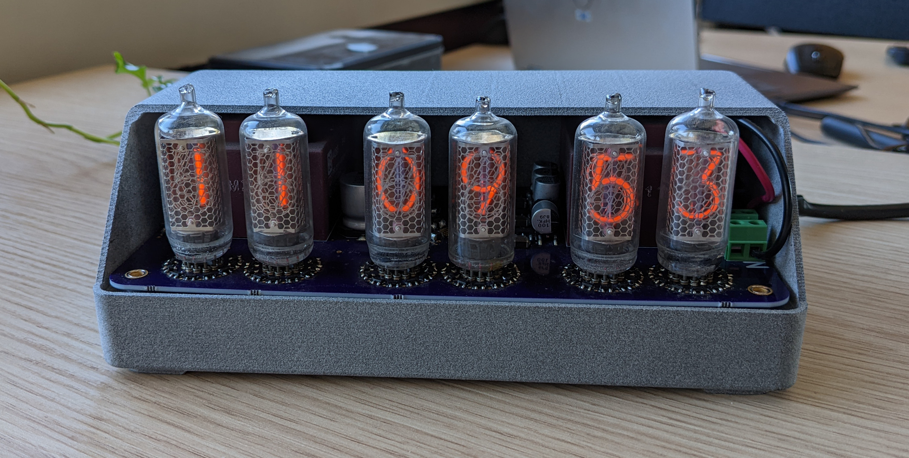
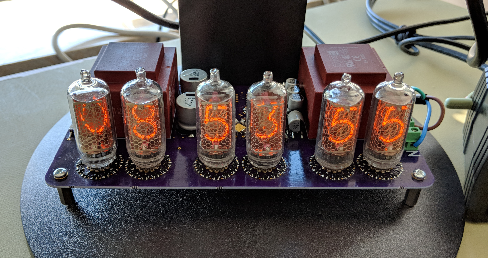
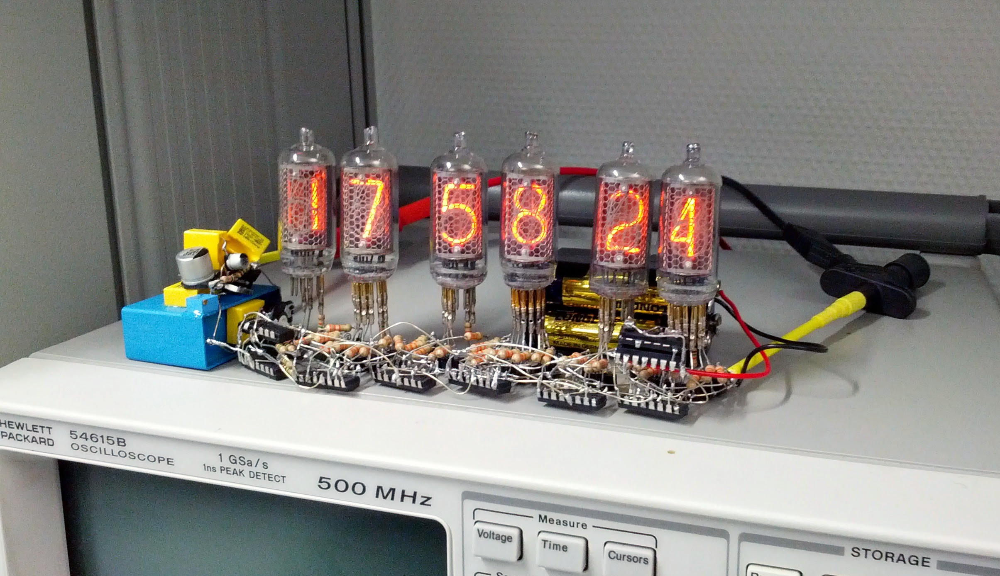
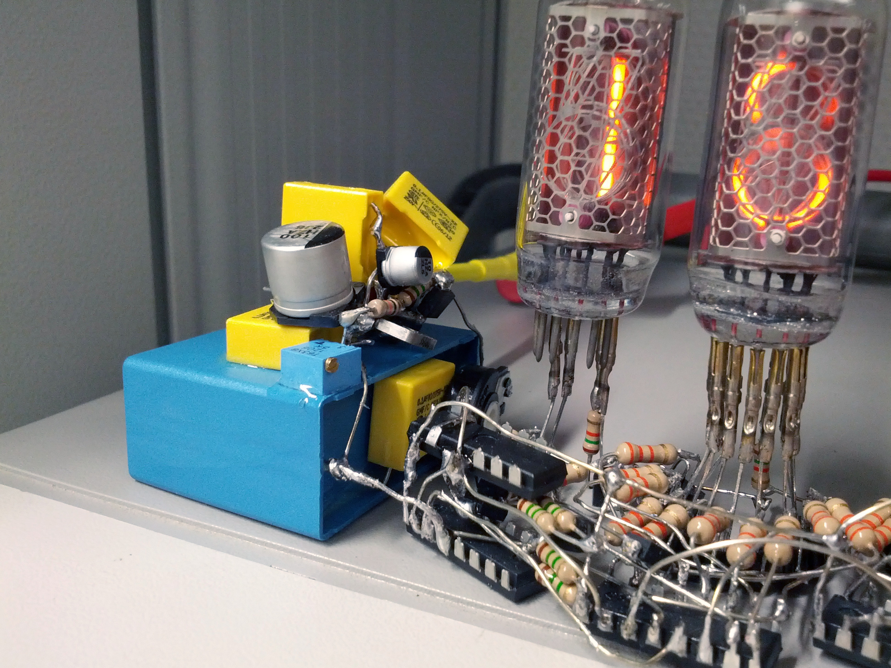
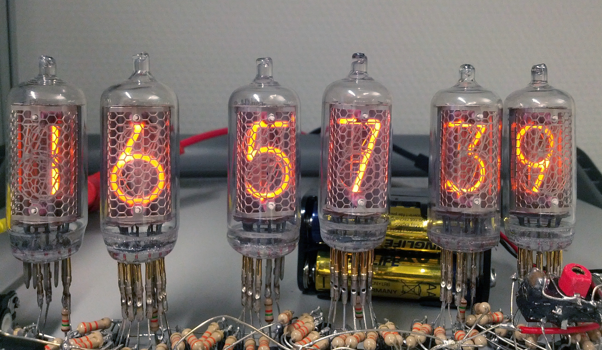
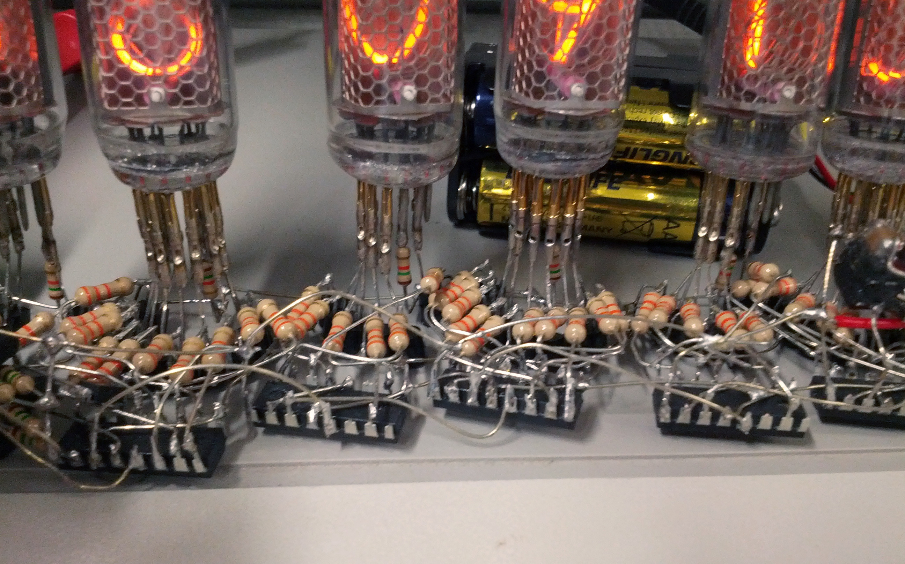

# Nixie Clock

An FPGA-based, GPS-synchronized timepiece with Nixie tubes.

This project is a GPS-synchronized clock that uses iconic Nixie tubes for its display.
The core logic is implemented on an FPGA, making it a robust and fascinating blend of vintage aesthetics and modern digital hardware.
This is the second iteration of the clock, designed to be more reliable and reproducible than the original dead-bug style precursor.

## Features

- 24 hour, UTC time display
- GPS time synchronisation
- Dimmable ИН-8 indicators
- 230 VAC power input
- Questionable safety
- Somewhat open-source (the design is, but the tools are not)

## Required tools

- Altium Designer for the PCB
- [FreeCAD](https://www.freecad.org) for the housing
- Altera / Intel Quartus for the FPGA

## Schematics

A PDF version of the schematics is available here: [PCB/Project Outputs for Nixie/Nixie.PDF](PCB/Project%20Outputs%20for%20Nixie/Nixie.PDF).

## Known issues

The first version requires more filtering on the low voltage power supplies.
An additional 200 μF on each linear regulator input fixes all brownout issues.

## Licenses

- The PCB and housing are licensed under the [CERN Open Hardware Licence Version 2 - Permissive](https://spdx.org/licenses/CERN-OHL-P-2.0.html).
- The FPGA code is licensed under the [MIT Licence](https://spdx.org/licenses/MIT.html).
- The pictures are licensed under the [CC BY 4.0 License](https://creativecommons.org/licenses/by/4.0/).

# History

This is, in fact, the second Nixie clock I've built. It's purpose is to replace the previous one that was built dead-bug style in 2013.

## How it worked

There are unfortunately no schematics for this one, as it was never meant to be reproduced.

It was based on a boost converter that turned 12 V into 200 V for the Nixie tubes.
The tubes were driven using high-voltage bipolar transistors.
The time was kept by decade counters, one for each digit, with simple diode logic for handling overflows on the hours, minutes, and seconds.
The clock source was a 32,768 Hz quarz crystal, with (most likely?) a 16-bit counter to divide it down to 1 Hz.
No programmable ICs were used in the design.

A backup power source in the form of 4 AA batteries was used to keep the time in case of external power loss.
This was necessary because the clock would be turned off at night to save power and wear on the tubes.
Setting the time was not easy, as no buttons were available.
The decade counters clock inputs had to be externally driven to increase the digits as necessary.

It was functional and kept the time surprisingly accurately, until the inductor of the boost converter released it's magic smoke.
It was most likely undersized for the task.

## Pictures

### Boost converter

A close-up view of the boost converter.
The IC cannot really be seen anymore under all the capacitors.
The component shaped like a metal bracked is actually a current sense resistor.
The blue potentiometer was used to fine-tune the output voltage.

### Tubes

A close-up view of the tubes.
The clock source can partly be seen in the lower-right corner.

### Decade counters

A close-up view of the decade counters.
Lots of resistors were used to drive the transistors.
It probably could have been simpler, but would not have looked as nice!
